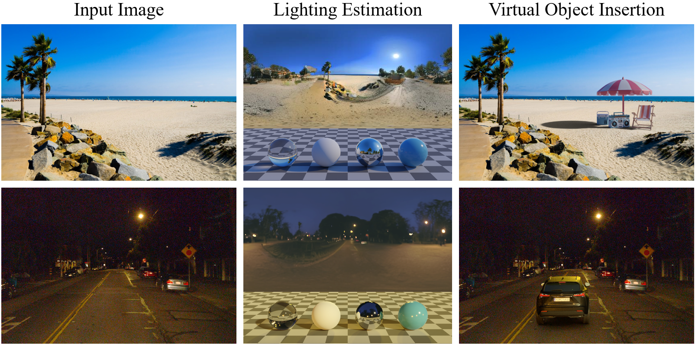

# LuxDiT: Lighting Estimation with Video Diffusion Transformer



[Ruofan Liang](https://www.cs.toronto.edu/~ruofan/), [Kai He](https://www.cs.toronto.edu/~hekai/), [Zan Gojcic](https://zgojcic.github.io/), [Igor Gilitschenski](https://www.gilitschenski.org/igor/),  [Sanja Fidler](https://www.cs.toronto.edu/~fidler/), [Nandita Vijaykumar](https://www.cs.toronto.edu/~nandita/), [Zian Wang](https://www.cs.toronto.edu/~zianwang/)

**[Paper](https://arxiv.org/abs/2509.03680) | [Project Page](https://research.nvidia.com/labs/toronto-ai/LuxDiT/)**

**Overview.**

LuxDiT is a generative lighting estimation model that predicts high-quality HDR envi-ronment maps from visual input. It produces accurate lighting while preserving scene semantics,enabling realistic virtual object insertion under diverse conditions.

## Installation

### Conda Environment

```bash
conda create -n luxdit python=3.10
conda activate luxdit
```

### Install Dependencies

You need to install PyTorch (tested with version 2.4) yourself depending on your system.
Then you can install the dependencies by:

```bash
pip install -r requirements.txt
```

## Model Weights

The model weights are available on [Hugging Face]().
We provide 2 checkpoints:

| Checkpoints                                                                                                                | Description                                                           |
| -------------------------------------------------------------------------------------------------------------------------- | --------------------------------------------------------------------- |
| [luxdit_base]()                     | Finetuned on image data, with LoRA adapter for real scenes                                               |
| [luxdit_video]() | Finetuned on video data, with LoRA adapter for real scenes |

You can download model weights by running the following command:

```bash
python download_weights.py --repo_id xxx/luxdit_base
python download_weights.py --repo_id xxx/luxdit_video
```


## Gradio Demo

We provide a Gradio web interface for the easy interaction with LuxDiT. To launch the demo:

```bash
python gradio_demo.py
```

The demo will be available at `http://localhost:7860` (or the URL shown in the terminal).

The Gradio interface provides:
- **Image Inference**: Upload a single image to estimate lighting
- **Video Inference**: Upload a video to estimate lighting from video frames
- **Model Configuration**: Choose between `base` and `video` models, configure LoRA settings
- **Inference Parameters**: Adjust resolution, guidance scale, number of steps, etc.
- **HDR Merger**: Optionally merge dual-tone mapped envmaps into HDR format

Make sure you have downloaded the model weights before running the demo (see [Model Weights](#model-weights) section).

## Output Format

By default, the camera pose of the input image is treated as the world coordinate frame, meaning each pixel on the environment map is defined relative to this camera frame. The centers of the output tonemapped environment maps (`*_ldr.png` and `*_log.png`) are oriented opposite to the input image’s camera direction—the input perspective image appears at the two edges of the environment map. When merging the dual-tone mapped environment maps into HDR format, an environment rotation is automatically applied so that the center of the HDR environment map (`*.exr`) aligns with the input image’s camera direction.

```
    Equirectangular environment map (unwrapped, left ↔ right = 360°):

    LDR / log (*_ldr.png, *_log.png):                          HDR after merge (*.exr):
    center = opposite to camera                                center = camera direction

    ◄─── input view ───┤   center   ├─── input view ───►                 │  center  │
    (at left edge)     │ (back dir) │    (at right edge)                 │ (fwd dir)│
    ┌──────────────────┼────────────┼──────────────────┐      ┌───────────────────────────────┐
    │     ........     │            │     ........     │      |                               |
    │   . input view . │            │   . input view . │      │        scene at center        │
    │   .  at edge   . │            │   .  at edge   . │  →   │   ........ (input)  ........  │
    │     ........     │            │     ........     │      │                               │
    └──────────────────┴────────────┴──────────────────┘      └───────────────────────────────┘
```

## Running Inference

Several different types of example inputs are provided at [`examples/input_demo`](examples/input_demo)

### Inference: Synthetic Rendering

This corresponds to the in-domain data used for finetuning the base DiT model.

Estimating lighting from *single images* of synthetic rendering:

```bash
DIT_PATH=checkpoints/luxdit_base
INPUT_DIR=examples/input_demo/synthetic_images
OUTPUT_DIR=test_output/synthetic_images
# Step 1: run dit to estimate dual-tone mapped envmap.
python inference_luxdit.py \
    --config configs/luxdit_base.yaml \
    --transformer_path $DIT_PATH \
    --input_dir $INPUT_DIR \
    --output_dir $OUTPUT_DIR \
    --resolution 480 720 \
    --guidance_scale 2.5 \
    --num_inference_steps 50 \
    --seed 33
# Step 2: run hdr merger to merge the dual envmap to hdr envmap.
python hdr_merger.py \
    --model_path checkpoints/hdr_merge_mlp \
    --input_dir $OUTPUT_DIR/ldr_log \
    --output_dir $OUTPUT_DIR/hdr
```

Estimating lighting from *video frames* of synthetic rendering (requires `--data_type video`):

```bash
DIT_PATH=checkpoints/luxdit_video
INPUT_DIR=examples/input_demo/synthetic_videos
OUTPUT_DIR=test_output/synthetic_videos
# Step 1: run dit to estimate dual-tone mapped envmap.
python inference_luxdit.py \
    --config configs/luxdit_base.yaml \
    --transformer_path $DIT_PATH \
    --input_dir $INPUT_DIR \
    --output_dir $OUTPUT_DIR \
    --resolution 480 720 \
    --guidance_scale 2.5 \
    --num_inference_steps 40 \
    --seed 33 \
    --data_type video
# Step 2: run hdr merger to merge the dual envmap to hdr envmap.
python hdr_merger.py \
    --input_dir $OUTPUT_DIR/ldr_log \
    --output_dir $OUTPUT_DIR/hdr
```

### Inference: Real Scenes

We introduce additional LoRA adapters to make LuxDiT better generalize to real scenes. You can play with `lora_scale` to adjust how much the input scene will be merged into the estimated envmap.

Estimating lighting from *single images* of real scenes:

```bash
DIT_PATH=checkpoints/luxdit_base
LORA_PATH=checkpoints/luxdit_base/lora
INPUT_DIR=examples/input_demo/scene_images
OUTPUT_DIR=test_output/scene_images
# Step 1: run dit to estimate dual-tone mapped envmap.
python inference_luxdit.py \
    --config configs/luxdit_base.yaml \
    --transformer_path $DIT_PATH \
    --lora_dir $LORA_PATH \
    --lora_scale 0.8 \
    --input_dir $INPUT_DIR \
    --output_dir $OUTPUT_DIR \
    --resolution 480 720 \
    --guidance_scale 2.5 \
    --num_inference_steps 50 \
    --seed 33
# Step 2: run hdr merger to merge the dual envmap to hdr envmap.
python hdr_merger.py \
    --input_dir $OUTPUT_DIR/ldr_log \
    --output_dir $OUTPUT_DIR/hdr
```

Estimating lighting from *video frames* of real scenes (requires `--data_type video`):
```bash
DIT_PATH=checkpoints/luxdit_video
LORA_PATH=checkpoints/luxdit_video/lora
INPUT_DIR=examples/input_demo/scene_videos
OUTPUT_DIR=test_output/scene_videos
# Step 1: run dit to estimate dual-tone mapped envmap.
python inference_luxdit.py \
    --config configs/luxdit_base.yaml \
    --transformer_path $DIT_PATH \
    --lora_dir $LORA_PATH \
    --lora_scale 0.8 \
    --input_dir $INPUT_DIR \
    --output_dir $OUTPUT_DIR \
    --resolution 480 720 \
    --guidance_scale 2.5 \
    --num_inference_steps 40 \
    --seed 33 \
    --data_type video
# Step 2: run hdr merger to merge the dual envmap to hdr envmap.
python hdr_merger.py \
    --input_dir $OUTPUT_DIR/ldr_log \
    --output_dir $OUTPUT_DIR/hdr
```

### Inference: Object Video Scan with Camera Poses

LuxDiT can also estimate lighting from multi-view object caputures (views remain sequentially smooth). Camera poses can be *optionally* provided to align the estimated envmap to a canonical envmap layout (`--camera_pose_file`, in OpenCV format). The provided 9-frame example is imported from [Object with Lighting](https://github.com/isl-org/objects-with-lighting).

```bash
DIT_PATH=checkpoints/luxdit_video
LORA_PATH=checkpoints/luxdit_video/lora
INPUT_DIR=examples/input_demo/object_scans/antman
OUTPUT_DIR=test_output/object_scans/antman
CAM_FILE=examples/input_demo/object_scans/antman/antman.camera.json
# Step 1: run dit to estimate dual-tone mapped envmap.
python inference_luxdit.py \
    --config configs/luxdit_base.yaml \
    --transformer_path $DIT_PATH \
    --lora_dir $LORA_PATH \
    --lora_scale 0.0 \
    --input_dir $INPUT_DIR \
    --output_dir $OUTPUT_DIR \
    --resolution 512 512 \
    --guidance_scale 2.5 \
    --num_inference_steps 40 \
    --seed 33 \
    --data_type video \
    --camera_pose_file $CAM_FILE
# Step 2: run hdr merger to merge the dual envmap to hdr envmap.
python hdr_merger.py \
    --input_dir $OUTPUT_DIR/ldr_log \
    --output_dir $OUTPUT_DIR/hdr
```

### Notes 

- Input resolution: the model is trained mainly with 2 resolution setting: 512x512 and 480x720 (default). You can use the `--resolution` argument to specify the input resolution. The input images will be resized and cropped to the specified resolution.
- Video frame length: the model is trained mainly with the mix of with videos with 7, 17, and 25 frames. Directly testing with longer videos may not work well.

## Training (Experimental)

We provide limited support for LuxDiT finetuning with LoRA. 

--- 

Training image LoRA on `luxdit_base`, 

```bash
accelerate launch train_luxdit.py \
    --config configs/luxdit_base_train.yaml
```

This training uses a [`dummy_hdri_list.txt`](prepare_data/data_list/dummy_hdri_list.txt) as the training data. You can change it to your own data list.

---

Training video LoRA on `luxdit_video`:

```bash
accelerate launch train_luxdit.py \
    --config configs/luxdit_video_train.yaml
```

This training uses [`dummy_hdri_list.txt`](prepare_data/data_list/dummy_hdri_list.txt) and [`dummy_web360_list.txt`](prepare_data/data_list/dummy_web360_list.txt) as the training data. You can change it to your own data list.

You also can append args `use_deepspeed=true deepspeed_config=configs/dist_config/zero_config/zero2.yaml` to enable DeepSpeed for less GPU memory usage.

## License

This project is licensed under NVIDIA OneWay Noncommercial License. See the [LICENSE](LICENSE.md) file for details.

## Citation

If you find this work useful, please consider citing:
```bibtex
@article{liang2025luxdit,
  title={Luxdit: Lighting estimation with video diffusion transformer},
  author={Liang, Ruofan and He, Kai and Gojcic, Zan and Gilitschenski, Igor and Fidler, Sanja and Vijaykumar, Nandita and Wang, Zian},
  journal={arXiv preprint arXiv:2509.03680},
  year={2025}
}
```